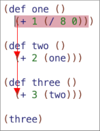

# Amacx

I’m experimenting with taking an axiomatic approach to adding
features to Lisp, using [Arc](http://arclanguage.org/) as a starting
point:

* Containers for top level variables.

* Source location tracking for profiling and showing the location of
  errors.

* Automatically persisting a program’s data.

These experiments may not work out.  The result may be too
inefficient, impractical, or ugly to be useful.

While naturally a successful experiment is more exciting than a failed
one, the failures may still be interesting: if something *can’t* be
done within the constraints, *why* can’t it be done?  What, exactly,
is the trade-off in language design that turns out to be necessary?


## Release

The current release is 0.0.2.

* Only parts of Arc are implemented so far.

* As I’m focused on trying experiments, the code is very messy.


## Motivation

I push the implementation in one dimension until I can make no further
progress without work on a different dimension.

For example, I have a sketch of an implementation (not yet included
here) for automatically persisting a program’s data.  Which is slow.
Too slow to be usable.  Optimization may make it faster, but it’s
unlikely to ever be as fast as an existing language that doesn’t
automatically persist data.

Slow though might be OK for high level scripting code, if there’s a
way to run at full speed the parts of the program that don’t need to
be persisted.

Maybe we add to the compiler a special form, perhaps we call it
`fast`, which would compile the enclosed expression in “fast” mode
which generated code which ran quickly but couldn’t be automatically
persisted.

Now suppose we want to use a function defined in `arc.arc` like
`memo`.  `memo` maintains a cache of previous calls to a function and
what it returned, so that if you call the function with the same
arguments again you get the cached value.  Would we like to be able to
have the cache automatically persisted?

Persumably yes, we’d like to have that option, if we can.  We could
restart the program and still have the previously cached values.
Which could be useful if the function is very expensive.  (Suppose,
for example, the function was making an API call to an external
service).

On the other hand, if the function is only moderately expensive, and
if we don’t particularly need to have the cache persisted, running a
slow version of `memo` could easily swamp any performance improvements
that we might get from caching the function call in the first place.

So we’d like to have a choice.  To be able to use the standard, fast
version of `memo` for when that makes sense, or the slower, enhanced
version of `memo` when that would be useful.

Which kind of `memo` we get depends where it’s loaded.

```
(def memo (f)
  (with (cache (table) nilcache (table))
    ...
```

If `memo` is loaded in a place where `table` is the ordinary fast
in-memory kind of table, then we get the standard, fast version of
memo.

Or, if `memo` is loaded in a place where `table` is the slower,
enhanced version of `table` which can automatically persist its data,
we get the slower but enhanced version of `memo`.

I call these places “containers” because they contain the top level
variables into which code can be loaded.

(Scheme uses the term “environment” and in Racket the analogous object
is called a “namespace”).

Containers by themselves don’t implement a module system (though it
might be possible to build a module system on top of containers), but
containers also allow modification of how code loaded into them work,
which isn’t something modules typically do.

Given that we want containers (or, at least I think we want
containers), how should they work?

To take an axiomatic approach, I suggest that a container should be
able to be treated as an ordinary Arc table.  That you should be able
to use an Arc table as a container if you wanted to.  `(obj + +)` is a
container that maps the top level variable `+` to the plus function.

Behind the scenes, when implementing Arc in Racket, we want to use a
Racket namespace because that’s what Racket is optimized for.

In terms of the *interface*, how the container should appear in Arc,
we want it to look like an Arc table.

That’s a hypothesis.  An experiment.  Containers might turn out to be a
terrible idea, or a poor choice for allowing code to be compiled
differently.  So I explore along the container dimension to find out.

Meanwhile, if we do end up mixing slow code and fast code, it would be
especially useful to have good profiler.  So another dimension is
source location tracking.


## Hoped-for Features

(If the various experiments work out).

* Source location tracking for profiling and to show the location of
  errors.

* Different code can be loaded into different containers, where each
  container has its own set of top level variables (a.k.a. “global
  variables”).

  A container for top level variables can be an ordinary Arc table
  (e.g., for taking an axiomatic approach of implementing Arc in Arc),
  or, for greater efficiency when desired, a Racket namespace.

* Top level variables, optional arguments, argument destructuring, and
  ssyntax are implemented as macros in Arc.

* Includes fallintothis’ port of quasiquote from clisp, which correctly
  handles nested `,@` (useful for macro defining macros).

* Multiple runtimes are supported simultaneously: for example, one
  container could implement Arc lists with Racket’s immutable pairs,
  while another container could implement Arc lists with Racket’s
  mutable mpairs.

* Support for additional features such as block strings and writing
  and destructuring tables with {...}.


## License

Amacx is licensed under the MIT license.

Libraries and components used by Amacx have their own license: Arc is
licensed under the Artistic license, and the quasiquotation library
ported from CLisp is licensed under the LGPL.


## Running Amacx

First, you’ll need to bootstrap:

```
$ cd xcompile
$ racket -f expand.scm
$ cd ..
```

This only needs to be done once (unless you modify the source code of
the compiler which is cross compiled), and creates an `xboot`
subdirectory.

Try running Amacs:

```
$ ./amacx examples/hi.arc
Hi
```

`hi.arc` contains:

```
(use arc)

(prn "Hi")
```

`(use x)` means `(load "x.arc")` from your library path, unless
"x.arc" has already been loaded before with `use`.  Thus the
`(use arc)` line loads “arc.arc” for you.

If you don’t include a program to run, you’ll get a REPL:

```
$ amacx
>
```

At this point though nothing but the builtins have been loaded yet
("arc.arc" isn’t loaded automatically).

```
$ amacx
> (prn "Hi")
Error: "prn: undefined;\n cannot reference an identifier before its definition\n  in module: top-level"
```

At the REPL you could first type `(use arc)` to load "arc.arc", or, the
`-u` command line option will also do the same thing for you:

```
$ amacx -u arc
> (prn "Hi")
Hi

```

Amacx supports different runtimes (different implementations of the
builtins), and you can use `-r` to specify which runtime to use:

```
$ amacx -r srcloc foo.arc
```

The default `mpair` runtime is similar to Arc<sub>3.2</sub>’s runtime
(though it implements Arc lists using Racket’s mutable pairs), while
the more experimental `srcloc` runtime allows forms read from a source
file to be labeled with source location information.

`-I path` adds a directory to the search path that `use` loads features
from.  In a program you can also say `(use lib
"/path/to/library/dir")`.

`-l file` loads a file (unconditionally, whether or not its been
loaded as a feature before, and without looking in the `use` include
path).  Thus if you’d like to load `foo.arc` and then get a REPL:

```
$ amacx -l foo.arc
>
```

You can also use `--repl` to get a REPL even if you’ve specified a
program to run:

```
$ amacx --repl foo.arc
>
```

Command line arguments end up in `argv`:

```
$ amacx --repl foo.arc one two three
> argv
("one" "two" "three")
```

By default, `amacx` loads Racket’s `errortrace` module, which
instruments the code to provide more information about run time errors
at the cost of running the code more slowly.  Use `-n` or
`--no-errortrace` to not load `errortrace`.

### TODO

* Startup is slow.

* `errortrace` is useful when used with the `srcloc` runtime which
  implements source location tracking to show the location of errors.
  It doesn’t help much with the `mpair` runtime (which, like
  Arc<sub>3.2</sub>, doesn’t track source locations).  It’d be better
  to default to not loading `errortrace` when using runtimes that it
  doesn’t help with.

* On an error in the `mpair` runtime the REPL avoids dumping the
  useless stack trace, but running a program with `amacx program.arc`
  currently does not.

* At the moment we default to loading code into a `symtab` container
  (like an Arc table but with an error if an undefined top level
  variable is referenced); using a Racket namespace for the container
  is implemented (see `src/racket-topvar.arc`) but isn’t used yet.

* The REPL supports command line editing (using Racket’s `readline`
  library) but not extended expressions that cross multiple input
  lines.  (See e.g.
  [pread.rkt](https://github.com/racket/readline/blob/v7.1/readline-lib/readline/pread.rkt)
  for some of the messy details that are involved in doing this in
  Racket).  Not sure yet how to incorporate this with the readtable
  hacking I’ve been doing.

* You can invoke the `amacx` script from a different directory
  (`/path/to/amacx/amacx foo.arc`), but there isn’t a mechanism to
  copy the `amacx` script to another directory (such as your bin
  directory) and to run it from there.


## DrRacket

You can install Amacx as a Racket “language” for use with DrRacket.

First, if you haven’t done it yet, do the bootstrap step described at
the beginning of the previous section.

```
$ (cd xcompile; racket -f expand.scm)
```

Then change directory into `rkt/amacx` and run `raco pkg install`:

```
$ cd rkt/amacx
$ raco pkg install
```

This creates a “linked” package installation (not a copy) where Racket
finds the package in this source directory.

Then in DrRacket you can load:

```
#lang amacx

(use arc)

(prn "hi")
```

Note that each `#lang amacx` file (module) is provided with its own
separate container for Arc’s top level variables.

Currently the `srcloc` runtime is always used.

### TODO

* Installing the collection by copying isn’t supported: if we install
  from the root `amacx` source directory Racket tries to install
  *everything* and chokes… we’d either need to figure out a subset to
  give to Racket, or see if there’s some raco configuration to select
  what’s included in the collection.

* We don’t have a way to specify the runtime here… perhaps `use` could
  be extended to be able to select the runtime?  That could be tricky.

* The REPL inside of DrRacket isn’t supported, we’d need a
  `#%top-interaction`… and I’m not sure if that could be made to work
  or not with the readtable hacking I’ve been doing to support block
  strings.

* There’s no provision to export Arc functions back to Racket for
  using Arc to write Racket modules (like how Anarki can).

* Startup is slow.  And runs every time you click DrRacket’s "Run"
  button.

* It’d be useful if Arc could ignore a `#lang` line… that way the same
  source code file could be loaded from both inside of DrRacket and by
  loading the program with `amacx` at the command line.


## Introduction to Containers

A container is an Arc table which contains the values of your top level
variables.

For example, if you run

```
(def foo () 123)
(= bar 456)
```

then `foo` and `bar` are added to the Arc table containing the top
level variables with `foo` and `bar` as keys and a function and `456`
as values.

Sometimes we call top level variables “global variables”, though they
aren’t really “global” when we can more than one container.

A container can also be any object which can be made to act like an
Arc table, such as a Racket namespace.

`this-container` provides a reference to the container that your code
is being eval’d or loaded into.

```
> (def foo () 123)
#<procedure:foo>
> (foo)
123
> (this-container!foo)
123
```

We can create new containers:

```
> (= c (new-container))
#hash((...))
> c!cons
#<procedure:mcons>
> (c!cons 1 2)
(1 . 2)
> (use-feature c 'arc)
nil
> (eval '(def foo () 123) c)
#<procedure:foo>
> c!foo
#<procedure:foo>
> (c!foo)
123
```

Here, `new-container` creates a new container and populates it with
Arc’s builtins such as `cons`.  The container however doesn’t have the
`def` macro yet because Arc hasn’t been loaded.  Next we load Arc,
and then we can eval Arc code in the container.


## Introduction to Runtimes

A runtime is how we implement a language once a program has been
compiled and is now running.

For example, in Arc 3.2, `cons` creates an immutable Racket pair,
`car` works with a Racket pair or a Racket symbol nil, and `scar`
modifies an Arc cons with Racket’s `unsafe-set-mcar!`.

These are all runtime decisions. We could create a different
runtime. For example, Arc’s `cons` could create a Racket mpair, Arc’s
`car` could operate on mpairs, and `scar` could use Racket’s
`set-mcar!`.

For Amacx I’ve written two runtimes so far. One I called “mpair”
because it implements Arc lists using Racket’s mpairs. The other I
call “srcloc” because it allows source location information to be
attached to Arc forms such as lists and atoms to show where in the
source an error occurred.

In a container, which runtime we’re using depends on which
implementation of Arc’s builtins the container was populated with.
For example, in a container set up for the “mpair” runtime, `car` will
the version of `car` which operations on Racket mpairs.  In “srcloc”,
`car` is also able to be applied to Racket syntax objects so that it
can be used with an Arc list read from a source code file.


## Implementing Containers with Macros

When the Arc compiler encounters a variable, it knows whether it’s a
lexical variable or not.  (It keeps a list of lexical variables that
are defined as it traverses down `fn` forms).  Likewise, when it sees
a variable that’s not a lexical variable, it knows that it’s a top
level variable.

We could have the compiler translate a top level variable into a
invocation of a `topvar` macro, giving us freedom on how we want to
implement top level variables.

```
   (+ 2 3)
=> ((topvar +) 2 3)
```

Then, if for example we had an Arc table that we’re using as a container
for top level variables:

```
arc> (= container (obj + + ...))
#hash((+ . #<procedure:+>) ...)
```

we might try implementing `topvar` something like this:

```
(mac topvar (var)
  `(container ',var))
```

Now the expansion would look like:

```
   (+ 2 3)
=> ((topvar +) 2 3)
=> ((container '+) 2 3)
```

We have a problem though!  `container` as used here is itself a top
level variable... so we’d have an infinite loop where `container`
would get expanded into `(topvar container)`.

When we generate code, we have the option of inserting either a
symbol naming a variable which contains a value, or the value itself.

```
arc> (eval '(+ 2 3))
5
arc> (eval `(',+ 2 3))
5
```

What does `',+` produce?  The `,` inserts the *value* of `+` (the `+`
function), and the `'` quotes it.

```
arc> `(',+ 2 3)
((quote #<procedure:+>) 2 3)
```

In most languages that have `eval`, only textual code can be evaluated
and it’s not possible to evaluate code containing arbitrary values.
Amacx is only possible because Racket has this feature.

Thus we can avoid the infinite loop problem this way:

```
(mac topvar (var)
  `(',container ',var))
```

and the expansion looks like:

```
   (+ 2 3)
=> ((topvar +) 2 3)
=> (('#hash((+ . #<procedure:+> ...)) '+) 2 3)
```

Purely for exposition, I'm going to use “⇒X” to mean “the value we got
from X that we inserted into our code”.  (“⇒” doesn’t actually appear
in the language).  Then I can show the expansion like this:

```
   (+ 2 3)
=> ((topvar +) 2 3)
=> (('⇒container '+) 2 3)
```

We’ve done something interesting here: we’ve implemented top level
variables entirely with macros.  The compiled code ends up having a
reference to the container without the underlying runtime having to
know about containers itself.

Arc<sub>3.2</sub> compiles the Arc expression `(+ 3 2)` into the
Racket expression `(_+ 3 2)`.  (The underline is used as a prefix to
keep Arc names from colliding with Racket names).  `_+`, in turn, is
stored in a Racket namespace.

When compiling to Racket, it’s faster to reference top level variables
this way than it is to look up variables in a hash table.  We can
optimize for Racket by checking whether our container is a Racket
namespace:

```
(mac topvar (var)
  (if (isa container 'namespace)
       (ac-global-name var)
       `(',container ',var)))
```

where `ac-global-name` converts symbols like `+` into their prefixed
version `_+`.  Now we have an implementation that produces the same
result as Arc<sub>3.2</sub>:

```
   (+ 2 3)
=> ((topvar +) 2 3)
=> (_+ 2 3)
```

(We’d also need to ensure that our compiler passed through prefixed
variables rather than expanding them with `topvar`, or we’d get the
infinite loop again).

Well... so at this point have we actually accomplished anything?
Aside from doing what Arc<sub>3.2</sub> does in a more complicated
way?

I’m not entirely sure, but there are a couple ways that I think this
*might* be useful:

First, when taking a axiomatic approach to language design, being able
to use an ordinary Arc table as a container for top level variables
strikes me, personally at least, as being rather intuitive.  A
specification, if you will, of how things should work.  Or, at least,
how they *could* work.  (Whether actually useful or not, it was
surprising to me that top level variables could be implemented using
only macros).

And then in a particular situation (such as compiling to Racket), we
can find an optimization (such as using a Racket namespace) which is
more complicated but faster.

Second, we may not always be so lucky as to be implementing Arc on top
of a language as powerful as Racket.  While eventually we may
implement something specialized for efficiency reasons like Racket
does, when getting started it can be nice to have fewer things that
need to be implemented to get off the ground.

### TODO

* In Arc<sub>3.2</sub>, setting an item to `nil` in a table removes
  that key from the table, and there isn’t a way to distinguish
  between an item being set to `nil` and the item not being present at
  all.

  Thus when using a standard Arc table for your container, referring
  to a top level variable that hasn’t been assigned yields `nil`
  instead of an error like “undefined: cannot reference an identifier
  before its definition”.

  I wondered if this might actually be a problem for me in practice.
  After all, how often do I misspell a function or macro name, or try
  to use one before its definition?

  It turns out, *all the time* :-) And then it’s a pain to have to
  track down where I’m trying to call `nil`.

  With source location tracking, this is less of a problem because we
  can see where the call to `nil` is being attempted.  So this issue
  may be moot once source location tracking is fully implemented.

  In the meantime, it’s easy enough to have a specialized version of
  Arc’s tables which don’t remove items when they’re set to nil, and
  report an error when an undefined key is referenced.  In the current
  code this is a called a “symtab” (a pun on “symbol table”, since in
  typical usage all the keys in a container are symbols).

* Amacx currently boots using a symtab for the code’s container.
  Which kind of container to use should be an option.


## Containers and Modules

Containers kind of look like modules.  If `other` is a different
container containing a function `foo`, and I want to “import” foo into
my container, all I need to do is:

```
(= foo other!foo)
```

This doesn’t quite work for macros.  If `foo` is a macro that expands
into `bar`, I’d also need to import `bar` to get that to work.

There’s a trick though: rather than having `foo` expand into the
*symbol* `bar`, I could have it expand into the *value* of `bar` (the
function value if `bar` is a function, or the macro value if `bar` is
a macro).

```
(mac foo ()
  (,bar "hi there"))
```

Now I can “import” `foo` and it will be referring to `bar` in its own
container, and I don’t have to import `bar` as well for it to work.

Thus we can implement a module system using containers (without some
other language extension such as namespacing symbols or using syntax
objects), if we don’t mind using extra commas in our macro
definitions.  For example, here’s the Arc<sub>3.2</sub> definition of
`complement`:

```
(mac complement (f)
  (let g (uniq)
    `(fn ,g (no (apply ,f ,g)))))
```

If we want to be able to use `complement` without having to have
compatible versions of `no` and `apply` (for whatever reason...), we
can insert them too:

```
(mac complement (f)
  (let g (uniq)
    `(fn ,g (,no (,apply ,f ,g)))))
```

At first I found this awkward, but then I quickly got used to it.  Now
my brain sees a comma and says “ah, something we’re inserting” and it
seems natural to me.

Just because we *can* do something doesn’t mean we *have* to.  If you
prefer, you could implement modules with macros by namespacing symbols
(like Closure does), or by replacing symbols with syntax objects (like
Racket does).

For myself, I find dealing with syntax objects or namespaced symbols
overly complicated.  I like being able to write macros with plain
symbols, and, as it turns out, I don’t mind using extra commas to do
so.

Amacx doesn’t implement a module system, though it makes it *possible*
to implement a module and macro system using plain symbols (which most
languages can’t do).  But Amacx doesn’t prevent you from implementing a
different kind of module system either.

As an analogy, consider how it’s easy to implement an object-oriented
programming system in Arc if we want to, but Arc doesn’t need
to implement object-oriented programming itself to let us do that.


## Containerizing Code

There’s something that containers can do that modules don’t: we can
use containers to do things *to* code, rather than simply using them
to *provide* us with code like modules do.

As an example, here’s the definition of `map1` in Arc<sub>3.2</sub>:

```
(def map1 (f xs)
  (if (no xs)
      nil
      (cons (f (car xs)) (map1 f (cdr xs)))))
```

What `map1` produces, of course, depends on what `cons` produces.

Let’s say I wanted a version of `map1` that produced, oh, I don’t
know, hyperblocks.  (I don’t know what a hyperblock is, but let’s
pretend! :-)

OK:

```
(= other!cons hyperblock)
(load "map1.arc" other)
```

Thus containers are something we can load code *into*.  We can load
code into a container using `load`, or, if we have some kind of module
system, we could import or otherwise copy code into a container as well.


## Runtimes

Before we can start loading code into a container, we first need to
populate it with the builtin functions, Arc’s primitives (or the
primitives of your language that you’re using Amacx for).

Assuming we have a source to copy the builtins from, creating a new
container with the builtins is as simple as making a copy:

```
(= my-container (copy my-builtins))
```

These builtins in turn define the runtime: for example, does `cons`
return a Racket immutable pair or a mutable mpair?  Does `car` only
work on Arc lists, or does it also work on Racket lists (assuming
they're different in the implementation)?  Does `((eval '(fn args
args)) 'a 'b 'c)` produce an Arc list?  The answers depend on what the
builtins do.

At the moment there are two runtimes implemented in Amacx:

`mpair` strictly implements Arc lists with Racket mpair’s and `nil`,
and Racket lists (constructed with Racket pairs and the Racket empty
list) never appear in the Arc runtime.

For practical purposes less strictness is useful: it’s convenient if
`car` also works on Racket lists for example.  However I find `mpair`
helpful in establishing a baseline for corner cases such as the
behavior of using lists as a compound key in a hash table.

`srcloc` implements associating values such as symbols and lists with
the source file locations that they were read from.  Like `mpair`,
`cons` produces a Racket `mpair`; but `car` and `cdr` can also be
applied to Racket lists.

Other options are possible.  We could have a runtime that implements
Arc lists with Racket pairs munged with the “unsafe” car and cdr set
operations like Arc<sub>3.2</sub> does, or we could have a runtime
where Arc lists are immutable by default if we wanted.

For my own Arc inspired language Eternal, I’d like to write a runtime
implemented as an interpreter that can serialize closures.  As a naive,
unoptimized interpreter (at least at first), it would be very slow, but
might still be useful for top-level, “scripting” code that can call
faster code.

Since different containers can be populated with different builtins,
we can have containers running different runtimes.  Thus I could have
one container running Eternal, and then for code that needed to be
faster, that code could be loaded into an Arc container.


## use

We can start amacx with a new container containing nothing but the
builtins from a runtime:

```
$ amacx -r mpair
> 3
3
```

The container has builtins such as `+` (in this case, since I
specified `mpair` for the runtime, `mpair`’s version of `+`), but
since my container doesn’t even have `topvar` defined yet I’m not able
refer to them directly:

```
> (+ 3 2)
Error: "need topvar macro defined for top level variable +"
```

I can load the topvar macro and then it will work:

```
> (use topvar)
nil
> (+ 3 2)
5
```

Likewise, if Amacx implemented all of Arc, I could say `(use arc
strings)` to load both Arc and Arc’s `strings.arc` library.

To be clear, this isn’t a module system.  If it were, and Arc was a
module, the Arc source code (arc.arc) would be loaded *once*, and then
the definitions would be imported (copied) into whatever containers
(or modules) were using Arc.

Instead, if we create a second container and use Arc in that
container, the Arc source code gets loaded *again*.  This is less
efficient.  However, it also means that the behavior of Arc can be
*modified* by the container that it gets loaded into.

A second difference is that since code is loaded into the container,
if A uses B and B uses C, A will see all the definitions in B and C.
Nothing is hidden like in a module system where only public exports
are visible.

On the other hand, if we want multiple containers and it’s too slow to
load our code into each, containers are simply Arc tables.  Arc’s
`copy` will copy tables.

Within a container, `use` will only load features once.  Thus any code
that needs e.g. the strings library can say `(use strings)` without
`strings.arc` getting loaded multiple times in the container.

The runtime can also provide features.  Consider for example that
`apply` has a basic form that applies a list to a function:

```
(apply + '(1 2 3))
```

For convenience, `apply` also allows you to supply additional
arguments, which are also passed to the function:

```
(apply + 1 2 '(3 4))
```

In a host language like Racket it’s not hard to implement this more
general form of `apply` which takes multiple arguments. (See for
example `ar-apply-args` in Arc<sub>3.2</sub>’s `ac.scm`).

However in a less powerful host language it can be painful to
implement even something as simple as `ar-apply-args` as a primitive…

What if `apply` happens to be called with thousands of arguments
(perhaps as the result of code generation) but the host language
doesn’t itself support proper tail calls?  What if an exception is
thrown from one of the arguments to `apply`, but the host language
doesn’t itself support a compatible exception mechanism?  What if
continuations are involved and the host language doesn’t itself
support continuations?

Implementing just the basic version of `apply` that takes the
function and a single list argument can be challenging enough.
Implementing the more general version of `apply` as a primitive might
involve, in essence, compiling `ar-apply-args` by hand.

Thus we could prefer to have as a primitive that has to be implemented
just the basic form of `apply` which takes a function and a single
list argument (we could call that `apply1`), and then define the
general form of `apply` in terms of the primitive:

```
(def apply-args (args)
  (if (no args)
       nil
      (no (cdr args))
       (car args)
       (cons (car args) (apply-args (cdr args)))))

(def apply (f . args)
  (apply1 f (apply-args args)))
```

On the other hand, Arc calls `apply` a lot, and if we’re using a more
powerful host language like Racket where we can implement a more
efficient version, we’d prefer to use that one.

What we can do is allow the runtime to also provide features.  (Recall
that `use` doesn’t load a source file for a feature if a feature has
already been provided).  One of our programs will use `arc`, which in
turn will use `apply`.  If the runtime implements `apply` as a
primitive (like we can do in Racket), and provides `apply` as a
feature, then `(use apply)` becomes a no-op.  If the runtime doesn’t
provide `apply` then the Arc version will be loaded.

The Arc version thus also serves as a specification.  If there’s any
confusion about how `apply` should work in the presence of, for
example, Arc vs. Racket lists, exceptions, continuations, parameters,
threads, or serialization… we can say it should work like the Arc
version.


## Source locations for errors

When reading source code from a file, we could use Racket’s
`read-syntax` which will annotate the read forms with source
locations: that, for example, this particular symbol `foo` was read
from file `foo.arc` at line 6, column 10.  Racket uses these source
locations to show where an error occurred.

In Racket, these annotated forms are represented by syntax objects,
which contain the annotated form, its source location if available, as
well as potentially other information used by Racket’s macro system.

Consider a definition such as `no` in Arc:

```
(def no (x) (is x nil))
```

If this definition were read with Racket’s `read-syntax`, `nil` would
not be the plain symbol `nil`, but instead would be a syntax object
wrapping the symbol `nil` and containing a source location indicating
that this `nil` was read at column 18.  Thus calling this definition of
`no` with a plain symbol `nil` (or a `nil` read from any other
location) would return false.

In Racket, quoted forms are stripped of syntax information, which
solves this particular problem.  However in Arc macros can also
manipulate forms read from a source code file, such here in Arc’s
definition of `withs`:

```
(mac withs (parms . body)
  (if (no parms)
      `(do ,@body)
      `(let ,(car parms) ,(cadr parms)
         (withs ,(cddr parms) ,@body))))
```

If `parms` and `body` had been read from a source code file using
Racket’s `read-syntax`, then `no` wouldn’t work (`parms` wouldn’t be
plain symbol `nil`) and `(car parms)` and `(cadr parms)` wouldn’t work
(`parms` would be a syntax object, not a pair that you can take the
`car` or `cdr` of).  Thus in Racket, macros need to be aware that
they’re manipulating syntax objects instead of plain lists and
symbols.

We can try a different approach.  Imagine that when forms were read
from a source file, they were labeled with source location
information.  Arc builtins that didn’t care about the source location
information would ignore it, but it could be inspected when desired.

For example, `(is 'foo 'foo)` continues to return true because
`is` is looking at the symbols `foo` without looking at the
label indicating that the second `foo` came from a different column
than the first one.  Now macros such as `withs` don’t need to be
modified because they’d continue to work.

Ideally we’d implement a general purpose labeling feature for Arc with
an Arc representation of source file locations which could be used
with any host language, and then for Racket translate the Arc
representation into a Racket syntax object to support showing source
location in stack traces.

For the current `srcloc` runtime I simply maintain the Racket syntax
objects read using Racket’s `read-syntax`.  Arc primitives such as
`is`, `car`, and `+` unwrap syntax objects to obtain the wrapped form
to operate on, ignoring the syntax information.

A few more steps are needed.  The output of macros such as `withs`
would lose source file location information because quasiquotation
forms such as `` `(do ...)`` and `` `(let ...)`` produce new lists
that aren’t labeled.

We can have the macro expander heuristically give the output of a
macro expansion the same source file location information as the
input, if the macro itself doesn’t itself return a form labeled with
location information.

Here `heuristic-loc` gives an output expression `e` the same source
location information as an input expression `loc`, unless `e` already
has source location information (perhaps because a macro choose to
explicitly return more precise location information):

```
(def heuristic-loc (loc e)
  (if (hasloc e) e (srcloc loc e)))
```

In this implementation we label forms with source location information
by using Racket syntax objects; however syntax objects don’t survive
being quoted.  (In Racket `(quote x) passes most objects `x` through
unscathed, but syntax objects are converted to plain forms). Thus in
the `srcloc` runtime we need to tunnel quoted values by wrapping them
in a struct, and unwrapping them at run time when they’re used.

Finally, in Arc<sub>3.2</sub>, an Arc form such as `(+ 3 2)` is
compiled into a Racket form such as `(ar-funcall2 + 3 2)`, where
`ar-funcall2` checks to see whether the function is a Racket function
that can be called directly or an Arc object that needs to be handled
specially.

This makes the function application appear to originate from inside of
the `ar-funcall2` form.  We can instead curry the function application
and compile `(+ 3 2)` into the Racket form `((caller +) 2 3)`.

With these pieces in place DrRacket will show us a trace of where an
error occurred:



### TODO

* The stack trace printed on error in the `srcloc` runtime is
  voluminous, messy, and most of the information printed is
  irrelevant.  For example, the stack trace contains code excerpts…
  however, since what *Racket* sees is the Ail language *output* of
  Arc’s macro expansion, *that’s* what gets printed, not the original
  source code.  And, many of the stack trace entries come from the
  runtime and don’t provide any useful information about what went
  wrong in the user code.

  Pruning the stack trace to show only the useful information would
  make it a lot more readable.

* It’s not necessary to use Racket’s syntax objects to label forms
  with source location information in Arc; we could have some other
  mechanism to label objects in Arc.  Once we got to the point of
  eval’ing the code in Racket we’d need to convert Arc’s
  representation of forms labeled with source location information
  into Racket’s syntax objects for Racket to be able to use them in
  error traces… but we also wouldn’t have to tunnel Arc’s
  representation through Racket’s quote.


## uniq

In Racket we can bootstrap by loading Arc<sub>3.2</sub>, but if we
want to implement Arc or our own language on top of a more primitive
platform, it would be easier to cross-compile.

Thus we’d like to be able to write out the output of macro expansion
(the macro expansion of our compiler implementation in particular) so
that we can load it into a new runtime… including the symbols created
by `uniq`.

Similarly, if we implement a runtime sometime that supports
serialization, we’d again want an implementation of `uniq` which could
create symbols that would survive being serialized.  (We could also
consider cross compiling as being a special case of serialization).

Traditionally Lisp implements unique symbols with “uninterned”
symbols, that is, a symbol `foo` generated in one place won’t be equal
to a symbol `foo` read somewhere else.  However the identity of the
symbol would be lost when written out to a file, so that wouldn’t work
for cross-compiling.

Arc<sub>3.2</sub> takes a quick-and-dirty approach of generating
symbols by appending “gs” with an incrementing integer… good enough if
we don’t have symbols named “gs” in our own code, but if we start
loading macro expanded code created elsewhere how do we avoid
collisions?

A solution is to generate a universally unique identifier with enough
randomness that the likelihood of a collision is vanishingly small
(even if we ran a computer the size of the universe for the lifetime
of the universe).

```
> (uniq 'foo)
foo--qbKupVnquqTCtorG
> (mac example ()
    (w/uniq foo
      `',foo))
> (example)
foo--ianwTCealkSBQQp6
```


## An Arc implementation language

If we make `fn` a macro, then we can easily implement in Arc optional
arguments and argument destructuring, which in Arc<sub>3.2</sub> are
implemented in the compiler.

In Racket, the primitive version of `fn` is called `lambda`, so our
`fn` macro could perhaps look something like this:

(mac fn (args . body)
  (if (complex-args args)
       (complex-fn args body)
       `(lambda ,args ,@body)))

Here we check to see if the function arguments contain any optional
arguments or argument destructuring; if they do we’ll generate code to
handle that using `complex-fn`; if not we can simply delegate to
Racket by turning the `fn` form into a `lambda` form.

A pleasant side effect is that argument destructuring now works with
optional arguments.  I don’t know if I’ll ever use *use* argument
destructuring with optional arguments, but it’s nice that it works! :-)

A disadvantage is that now I’m reserving the name “lambda” for
compiling `fn` into Racket.  I can’t write my own function or macro
that happens to be named “lambda” without messing up `fn`.  I’d prefer
that “lambda”, or whatever we’re using to compile functions, have some
unique name that wouldn’t conflict with any of the names I might like
to use in my own program.

In Racket, “lambda” doesn’t have to be called “lambda”; I could for
example import `lambda` into a Racket module with a different name…
for example if I wanted to call the primitive form of `fn` something
like `$fn`.  I’d need a Racket module that I can eval the Racket code
the compiler produces, and in that module I can import `lambda` as
`$fn`:

```
(require (only-in racket (lambda $fn)))
```

Still, whatever name I choose causes that name to be reserved.  I
don’t care what the name is, and I’d prefer it was a unique name that
wouldn’t ever collide with a program I or someone else was writing.
If I could use `w/uniq` with Racket code…

```
(w/uniq $fn
  `(module my-racket-module racket
     (require (only-in racket (lambda ,$fn)))

     ... and then in Arc ...

       (mac fn (args . body)
         (if (complex-args args)
              (complex-fn args body)
              `(,$fn ,args ,@body)))))
```

I can’t actually do that, of course, but if I could, `$fn` would end
up being something like `$fn--xVrP8JItk2Ot`.

Someone could *look* at the macro expansion and *see* that it was
named `$fn--xVrP8JItk2Ot` and would then be free to use
`$fn--xVrP8JItk2Ot` themselves if they wanted to, but they wouldn’t
collide with `$fn--xVrP8JItk2Ot` by *accident*.

Of course, we could *pretend* that we were using `w/uniq`, and output
`$fn--xVrP8JItk2Ot` ourselves…

```
(mac fn (args . body)
  (if (complex-args args)
       (complex-fn args body)
       `($fn--xVrP8JItk2Ot ,args ,@body)))))
```

In essence, doing a bit of macro expansion by hand.

The primitive forms needed to implement Arc once macro expansion is
complete are `$quote`, `$fn`, `$assign`, `$if`, and `$call`.

I call this primitive language “Ail” (for “Arc implementation
language”). If a runtime can provide an implementation for Ail and a
minimal set of builtins such as `apply1`, we’ll have a working
implementation of Arc.

(Note that a “minimal set of builtins” includes implementing Scheme
features such as proper tail calls, exception handling, continuations,
and parameters… so that part may not be so easy).

The actual names of `$quote` and so on are `$quote--xVrP8JItk2Ot`
etc., which allows someone the freedom to use `$quote` etc. as names
in their own code without conflicting with the compiler.

This makes Ail a remarkably ugly language… yet the output of macro
expansion usually *is* ugly, and no one cares because no one has to
look at it.


## Compiler varients

With the compiler written in Arc, we could extend the compiler simply
by, for example, extending the definition of the compiler:

```
(defextend ac (s env) (is-ssyntax s)
  (ac (expand-ssyntax s) env))
```

This would offer a more powerful way of extending the language than
plain macros.  While beguiling, modifying the compiler in place turns
out to be really painful when building a compiler to implement a new
language.

With only a single compiler, the compiler ends up having to
simultaneously correctly compile the language the compiler is written
in (i.e. Arc) and the new language that the compiler is for.

Instead, my current approach is to first allow compiler rules to be
specified and given names, and then a compiler can be constructed by
supplying a list of compiler rule names to be used for that compiler.

For example, here’s a compiler for Arc:

```
(= a-compiler-for-arc
  (gen-compiler
    '(nil-sym this-container lexvar topvar quote assign-lexvar
      assign-topvar fn if explicit-call macro implicit-call
      default-quote)))
```

The generated compiler can then be called with a container and an
expression, and it’ll return the compiled expression.

Here’s an example of a compiler rule, one that recognizes a
lexical variable and returns the variable itself as the compilation
result:

```
(compiler-rule lexvar (and (isa e 'sym) (is-lexical context e))
  e)
```

The form of `compiler-rule` is `(compiler-rule name test . body)`.

Both the test and the body is called within a function that has
`context` and `e` as parameters.  `e` is the expression being compiled
and `context` contains the compilation context, including for example
the list of lexical variables that have been defined at this point.

Inside of a compiler rule, expressions can be recursively compiled
using `compile`:

```
(compiler-rule assign-lexvar (and (caris e '$assign)
                            (is-lexical context (cadr e)))
  (check-assign (cadr e))
  `($assign ,(cadr e) ,(compile context (caddr e))))
```

Here, `$assign` is the primitive version of Arc’s `assign` (which
itself is an Arc macro that expands into `$assign`).  With an
expression like

```
($assign x (+ 2 3))
```

We pass through the variable name `x` unchanged, and recursively
compile the expression `(+ 2 3)`.

`context` contains a reference to the compiler generated by
`gen-compiler`, so `compile` recursively compiles using the compiler
that was originally invoked.


### TODO

* For the `srcloc` runtime, the source location heuristic is applied
  by `compile`.  This seems overly specific (e.g. what if we wanted a
  compiler that didn’t apply source location heuristics, or wanted to
  determine source locations in a different way)… but probably better
  to wait for an example, as any speculative design I try to come up
  with now might not work for what would need to be done in practice.


## Bootstrapping

With the compiler for Arc written in Arc, naturally we need a working
version of Arc in order to run the compiler.

When using Racket, we can start with Arc<sub>3.2</sub> (as its
compiler is written in Racket) and so bootstrap by compiling our
compiler for Arc using Arc<sub>3.2</sub>’s compiler.

For other target languages, an easy approach is to macro expand the
compiler.  The output of macro expansion is Ail, the primitive
language implementing Arc after macro expansion.  The target language
then only needs to provide an implementation of Ail in order to run
the compiler.

A gotcha here is that the output of macro expansion in Amacx isn’t
purely textual, as it is in other languages.  The output of macro
expansion can include arbitrary objects such as procedures.

For example, implementing top level variables with containers using
macro expansion means that the container is injected into the macro
expansion output.

Similarly, if macros inject the functions they use, we end up with
procedure objects in the output.

We could have a variant of our compiler and language definition in
which macro expansion produces purely textual output (like
Arc<sub>3.2</sub> does for example).  We could then use that version
in the target language to bootstrap into the version which supports
containers and the other features of Amacx.

There’s a trick we can do though.  Although macro expansion *allows*
injecting arbitrary values into the macro expansion output, the only
values that actually *do* end up getting injected into the macro
expansion output when we compile the compiler are the container and
functions assigned to top level variables.

Thus as an additional step, we can convert the macro expansion of
compiling the compiler into a purely textual form using the following
algorithm:

* If we see the container, replace it with a named value
  “this-container”.

* If we see a procedure, do a reverse lookup in the container to find
  a key which maps to the procedure, and replace the procedure with
  that name.

For naming these values, I use a Racket [boxed
value](https://docs.racket-lang.org/reference/boxes.html) for
convenience.  That detail doesn’t matter though, as we could use any
textual representation that distinguishes named values.

As an example, consider the `def` macro which expands a function
definition like `(def caar (xs) ...)` into Ail code like this:

```
   ($call ($quote ⇒sref) ($quote ⇒this-container) 'caar ($fn (xs) ...))
```

(Recall that “⇒X” is a notational convenience to mean “the value we
got from X which we inserted into our code).

Here we call the `sref` builtin to set `caar` in the container to the
function implementing `caar`.

Replacing the injected values with the named version results in a
textual form that we can save to a file:

```
   ($call ($quote #&sref) ($quote #&this-container) 'caar ($fn (xs) ...))
```

(In Racket `#&` creates a box literal.  Note however the textual
representation isn’t all that important, we could for example generate
JSON if we were targeting JavaScript… whatever would be convenient to
read in the target language).

To bootstrap in a target environment, we apply the algorithm in
reverse: replace a named “this-container” with the actual container
we’re bootstrapping into, and replace a named function with the
function value found in the container with that name.

Some of the named procedures will be builtins like `cons`, while
others will be functions defined in Arc that we’re loading from the
macro expansion output.  Thus the algorithm needs to be applied one
form at a time: first we replace named values with their actual values
in the bootstrap container, then we execute the resulting Ail code;
and then we proceed with the next form.

To get started with Amacx, first run the cross compiler which is
written in Arc<sub>3.2</sub>:

```
$ cd xcompile
$ racket -f expand.scm
```

This creates the `compiler.nail` file, the Amacx compiler macro
expanded into Ail with injected values converted to named values.

Then when we run Amacx:

```
$ amacx
```

it bootstraps by loading `compiler.nail` into a bootstrap container.
This provides `eval`, `load`, `use`, `repl`, and so on, which Amacx
can then use to load Arc code.

## Supported features

While Amacx is a compiler, it should be able to support language
features such as those described below, which in turn helps us see what
capabilities the compiler should have.

By analogy, consider how a Linux device driver is independent of the
Linux kernel (it can be developed separately and installed
dynamically), but the kernel source tree includes device drivers as
that helps make visible what the kernel needs to support for device
drivers and allows device driver implementation to be refactored along
with the kernel.


### Curly brackets for tables

`curly-table` allows curly brackets to be used for table literals.

```
(use curly-table)

{a 1, b 2}
```

produces the same table as `(obj a 1 b 2)`.

I found that having no syntax in the curly brackets and using e.g.
`{a 1 b 2 }` without a comma was visually too confusing for me.  Adding a
comma to the syntax was enough, I found I didn’t need to, for example,
also add a colon (like JavaScript) to make it visually discernible.

The comma needs to immediately follow the value expression to be
recognized as a separator (instead of a quasiquote unquote
expression).

The value expression can be omitted and defaults to being the same as
the key (typically becoming variable reference), thus

```
(with (a 1 b 2)
  {a, b})
```

is like saying `(with (a 1 b 2) (obj a a b b))` and results in the same
table as `(obj a 1 b 2)`.

With `curly-destruct`, tables can be destructed:

```
(use curly-destruct)

(let {a, b} (obj a 1 b 2)
  (list a b))
```

returns `(1 2)`.

If you’d like to use a different variable name than what you’re using
for the table key, the `{ var key }` form can be used:

```
(let {a 'x, b 'y} (obj x 27 y 28)
  (list a b))
```

Interestingly, the object being destructed doesn’t have to be a table.
The object is called with the key to obtain the value, and any
callable object can be used (including a function):

```
(let {a} string
  a)
```

returns `"a"`.

#### TODO

* Implement a printer, and print tables with curly brackets.


### Block strings


Racket, like many languages, implements a “here” string:

```
(prn #<<END
hello
there
END
)
```

The characters after the `#<<` define the delimiter.  The text on the
following lines, up to the delimiter on a line by itself, becomes the
contents of the string.  Parsing continues after the line with the
delimiter.

Using “here” strings can be awkward.  Any indentation is included in
the string, so if you don’t want the contents of the string to be
indented you need to left-justify the string without indentation.  Any
part of the program which needs to appear after the string literal
(such as the closing `)` here in this example) needs to follow after
the final delimiter.

Block strings are an alternative:

```
(prn §)
  │ hello
  │ there
```

The `§` (a section sign character) declares that the following lines
will be a block string.  Parsing continues after the `§`, so that here
in this example the closing `)` can appear naturally on the same line
with the opening `(prn`.

A block string line is any number of spaces and tabs, followed by a
`│` (Unicode U+2502, the box drawings light vertical character),
followed by exactly one space, and then the contents of the string
literal.  This allows the string to be indented naturally.

The resulting string literal is `"hello\nthere"`, as if the code had
been:

```
(prn "hello\nthere")
```

Newlines are used to separate lines in the string literal, but the
last line doesn’t have a newline appended.  (It’s a bit easier to add
a final newline when you want one than to have to remove an unwanted
newline).

The `§` is handled by a Racket readtable, so if the `§` appears inside
of a string or as a character literal it doesn’t trigger parsing
block strings:

```
(prn "§")
(prn #\§)
```

#### TODO

* Block strings don’t fit in very well with Racket’s parsing model.
  In Racket, `read` is supposed to consume a single datum from an
  input port, potentially peeking ahead in the input port if it needs
  to, but not otherwise maintaining state.

  To allow Racket’s `read` to be used, I implemented a synthetic
  “splicing port” which wraps the input port.  The splicing port
  presents to Racket the section sign, the characters on the line
  after the section sign, and the characters after the block string
  lines… but the block string lines themselves are excised from the
  input that Racket sees.

  This works, but it’s not very intuitive, and it means that in all
  the places where `read` might be used (at the REPL, loading from a
  file, and so on), the splicing port has to be set up explicitly.

  Though I haven’t worked on an implementation, I’m imagine that a
  more intuitive model might be to implement parsing using generators:
  the parser would generate datums and the program would consume them.
  This would also simplify ports (which are complicated in Racket)
  since with the parser able to maintain state, ports wouldn’t have
  to implement peeking.


## Contribute

* Feature requests: if you might like to use Amacx as a compiler for
  your own Arc inspired language, please let me know what features it
  would need to be able to do that.

* Unit tests: unit tests are vital for development.  For a compiler
  like Amacx, they’re not just helpful and a time saver; unit tests
  makes development possible.  (Some low hanging fruit here might be
  to port some unit tests from Anarki).

* TODO’s: pick a TODO from here or in the source code and see if
  that’s something you might like to tackle! :-)

See [CONTRIBUTING.md](CONTRIBUTING.md) for how to sign off on
contributions.

Thank you!


## Donate

You can directly accelerate the development of Amacx and Eternal with
a donation: https://donorbox.org/amacx-and-eternal


## Contact me

I can be reached at [andrew@awwx.ws](mailto:andrew@awwx.ws)
